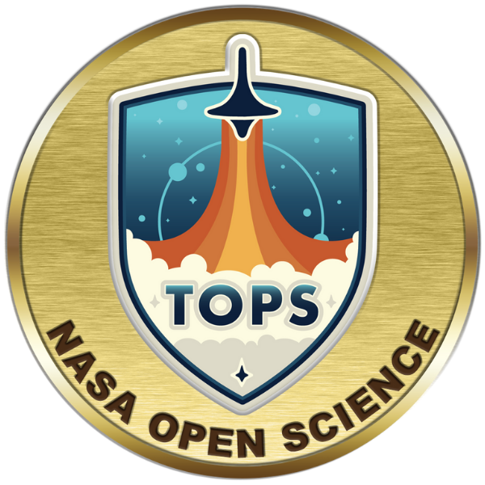

### Hello!
I'm a plant evolutionary biologist by training and data scientist by trade. 

- I’m currently working on Open and Fair data and metadata publication guidelines, workflows, and tools for the [National Park Service](https://github.com/nationalparkservice).
- I’m interested and excited to collaborate with anyone working on data publication, metadata creation, and promoting culture shifts towards Open data for equitable and reproducible science. 

If you're interested in my plant biology work (🥦🧬🔬🖥), please check out my [other GitHub account](https://github.com/rlbaker5).

 &emsp;     &emsp;   &emsp;  &emsp; 

<!--
**RobLBaker/RobLBaker** is a ✨ _special_ ✨ repository because its `README.md` (this file) appears on your GitHub profile.

Here are some ideas to get you started:

- 🔭 I’m currently working on ...
- 🌱 I’m currently learning ...
- 👯 I’m looking to collaborate on ...
- 🤔 I’m looking for help with ...
- 💬 Ask me about ...
- 📫 How to reach me: ...
- 😄 Pronouns: ...
- ⚡ Fun fact: ...
-->
